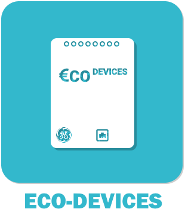

# Plugin ecodevice pour Jeedom

Plugin permettant de gérer les ecodevices

### Market

Retrouvez le sur le Market Jeedom [ici](https://www.jeedom.com/market/index.php?v=d&p=market&type=plugin&name=ecodevice)

### Documentation

Vous trouverez la documentation [ici](https://github.com/Jeedom-Plugins-Extra/ecodevice/blob/stable/docs/fr_FR/index.md)

### Prévisualisation

### Forum

Lien vers le forum [ici](https://www.jeedom.com/forum/viewtopic.php?f=149&t=2033)

### Chatroom

Lien vers le chat [ici](https://discord.gg/eC3G2x9)

### Fonctions disponibles

Infos :
* Carte ecodevice :
  + Statut

* Compteur :
  + Consommation journalière
  + Consommation total
  + Débit instantané

* Téléinfo (certains indicateurs ne sont disponibles que pour certains type d'abonnements):
  + Index (base)
  + Index (heures creuses)
  + Index (heures pleines)
  + Index (heures creuses jours bleus Tempo)
  + Index (heures pleines jours bleus Tempo)
  + Index (heures creuses jours blancs Tempo)
  + Index (heures pleines jours blancs Tempo)
  + Index (heures creuses jours rouges Tempo)
  + Index (heures pleines jours rouges Tempo)
  + Index (normal EJP)
  + Index (pointe mobile EJP)
  + Intensité instantanée
  + Intensité instantanée Phase 1
  + Intensité instantanée Phase 2
  + Intensité instantanée Phase 3
  + Puissance Apparente
  + Option tarif
  + Couleur demain
  + Tarif en cours
  + Évolution index (base)
  + Évolution index (heures creuses)
  + Évolution index (heures pleines)
  + Évolution index (heures creuses jours bleus Tempo)
  + Évolution index (heures pleines jours bleus Tempo)
  + Évolution index (heures creuses jours blancs Tempo)
  + Évolution index (heures pleines jours blancs Tempo)
  + Évolution index (heures creuses jours rouges Tempo)
  + Évolution index (heures pleines jours rouges Tempo)
  + Évolution index (normal EJP)
  + Évolution index (pointe mobile EJP)
  + Intensité souscrite
  + Intensité maximale
  + Intensité maximale Phase 1
  + Intensité maximale Phase 2
  + Intensité maximale Phase 3

Actions :
* Carte ecodevice :
  + Reboot
* Compteur :
  + Aucune
* Téléinfo :
  + Aucune

Scénarios possible (ceux que j'ai chez moi) :
* Sortir des statistiques sur les consommations.
* Alerter en cas de sur consommation

## <a href="https://creativecommons.org/licenses/by-sa/4.0/"> Team Jeedom-Plugins-Extra </a> 👍

### Retour à l'accueil du [Wiki](https://github.com/Jeedom-Plugins-Extra/Jeedom-Plugins-Extra/wiki) ou de la [Team](https://github.com/Jeedom-Plugins-Extra)
